# Muse Code for Security Research

*Wiring Burp Suite, Meta’s bug bounty research toolkit, headless Ghidra and LLDB into Meta’s terminal coding agent over MCP, then pointing it at PortSwigger’s deliberately vulnerable demo site, a real bounty programme, and a real CVE buried in a stripped binary.*

|  |  |
|---|---|
| **Section** | [Muse Code](https://dev.meta.ai/docs/cookbook#building-with-muse-code) |
| **Time to complete** | ~30 min read, ~150 min to complete |
| **Model** | `muse-spark-1.3-contributor` |
| **Harness** | Muse Code 1.1.1 (the `muse` CLI) |

## Summary

Muse Code is Meta’s terminal coding agent; out of the box it reads code, edits files, and runs shell commands inside an OS-enforced sandbox. What it doesn’t know how to do is drive a web proxy, decompile a binary, or debug a process, and that’s the gap the Model Context Protocol fills.

An MCP server is a process that exposes a set of named, typed tools and nothing else. Wiring Burp in doesn’t hand the model a shell inside Burp; it hands it twenty-four specific functions such as `get_proxy_http_history` and `send_http1_request`.

Burp Suite is PortSwigger’s collection of tools for security testing web applications — an intercepting proxy, scanner, and repeater, among others. Here we use its proxy history and its MCP extension, in the free Community Edition.

This write-up aims to illustrate how to wire a set of security tools into Muse Code as MCP servers, and then put each of them to work on a target that actually has bugs in it. All targets are authorized POC territory: the web half uses PortSwigger’s deliberately vulnerable demo site, the native half uses a public CVE with a published patch.

*   [Part one](#part-one---web-endpoints), Burp Suite. The agent reads proxy history, replays requests against PortSwigger’s deliberately vulnerable demo site ([ginandjuice.shop](https://ginandjuice.shop), published for exactly this purpose), and builds its own proof of the lead it picks. This half is set up for you to run rather than read, and the target publishes an answer key so you can grade it yourself. Everything works on Burp Community.

*   [Part two](#part-two---meta-bug-bounty-research), Meta’s own bug bounty toolkit. The same Burp session, plus Zurp: SPARTA leads to say where to look, Meta Context to say what an identifier names, and FBDL to build accounts you are allowed to attack — in Burp and over MCP, on one token. There is no answer key for this one, the access is gated, and this half needs Burp Professional.

*   [Part three](#part-three---native-binaries), Ghidra and LLDB. The agent gets a stripped binary and a file that crashes it, and works back to the root cause of a real CVE in a JPEG 2000 decoder. Also set up for you to run, and the upstream patch is public, so you can grade this one too.

Neither bug is novel, and that’s rather the point; what the agent does is correlate, prove and document, which are the mechanical and attention-hungry parts of security work. Everything here was run end to end rather than transcribed from documentation.

## Setting Up Muse Code

### Install

Install Muse Code from [https://dev.meta.ai](https://dev.meta.ai) — the site provides platform-specific installers for Windows, macOS, and Linux, so you always get the current binary for your platform, even if the direct download path changes.

On macOS and Linux the one-liner drops a native binary on your path:

```
curl -fsSL https://dev.meta.ai/install.sh | sh
```

Confirm it landed:

```
$ muse --version
Muse Code 1.1.1 (1.1.1-R2514.1)
```

The installer puts the binary in `~/.local/bin` by default, so make sure that’s on your `PATH`.

### Authenticate

You need a Muse Code account before any of this works; sign-up and current pricing are on the [product page](https://developer.meta.com/ai/products/muse-code/).

Run `muse` in any project directory. On the first entry you’ll be asked whether to trust the workspace, and then offered either a browser sign-in or an API key.

```
cd /path/to/your/project
muse
```

For anything scripted, headless, or CI-bound, skip the browser and use an environment key:

```
export META_API_KEY="<your-key>"
```

Or store it once with `muse auth set`. Precedence is `META_API_KEY`, then a stored key, then a stored browser session. You can reopen the sign-in options mid-session with `/login` and clear stored credentials with `muse logout`, though note that `muse logout` won’t unset an exported `META_API_KEY`.

### The Settings File

User settings live at `~/.config/muse/settings.json`; this one file holds model defaults, TUI preferences, hooks, the `runtime_capabilities` map, telemetry options, and MCP servers.

A minimal starting point:

```
{
  "schema_version": 1,
  "model": "muse-spark-1.3-contributor"
}
```

### How Muse Code Loads MCP Servers

Servers are declared in the `mcpServers` block of `settings.json`, and MCP configuration lives in this file and only this file.

Each server takes a `transport`, which is one of two values:

| Transport         | Fields                                       | Use it for                                                  |
| ----------------- | -------------------------------------------- | ----------------------------------------------------------- |
| `stdio`           | `command`, `args`, `env`, optional `framing` | Local processes: a Python bridge, a proxy jar, a `uvx` tool |
| `streamable_http` | `url`, `headers`                             | A server already listening on a port                        |

Every server also accepts `enabled`, a boolean toggle so you can park a server without deleting its config, and `mode`, which defaults to `"required"`. If a required server fails to start the whole run aborts:

```
agent loop failed: model failed: invalid run configuration:
Required MCP server `burp` failed during startup: initialization failed.
```

Two practical notes before you add a security tool to this block:

*   Set `mode: "optional"` on every tool-backed server. Burp is a GUI app you start by hand and forget to start; on the default `required`, forgetting means Muse Code refuses to run at all in that project until you notice, whereas `optional` degrades to a warning.
*   Servers load at startup, so edit `settings.json` and then start a new session; there’s no reload.

Once a session is running, use the `/mcp` slash command to see which MCP servers loaded, which tools they expose, and whether any failed to start. That’s the fastest way to confirm a new server is wired correctly before handing the agent a task.

## Part One - Web Endpoints

The agent gets a proxy it can read, a target it’s allowed to touch, and a bug it has to prove.

### Wiring Up Burp Suite

Burp Suite is PortSwigger’s web application security testing toolkit — at minimum an intercepting proxy that records every HTTP request you make, which the agent can then read and replay.

Everything in this section was run end to end on MacOS with Burp Suite Community 2026.8.0 and Muse Code 1.1.1.

The commands are MacOS-specific, so Homebrew, `/opt/homebrew`, and `/Applications`. On Linux the shape is identical; you install Burp and a JDK through your package manager, and the extension jar lands under `~/.BurpSuite/bapps/` just the same.

Installing Burp

```
brew install --cask burp-suite     # Community Edition, free
```

The cask sets a quarantine attribute on the bundle, so launch the app once from Finder and clear the Gatekeeper prompt before doing anything on the command line. Skip this and every later step fails in confusing ways.

Installing the Extension

Burp can be extended by installing BApps — official or community extensions from the BApp Store that add new tools, tabs, and integrations.

The MCP server is an official BApp and it installs in Community Edition; there’s no Professional requirement for the extension itself. Go to Extensions → BApp Store, search for MCP Server, and click Install.

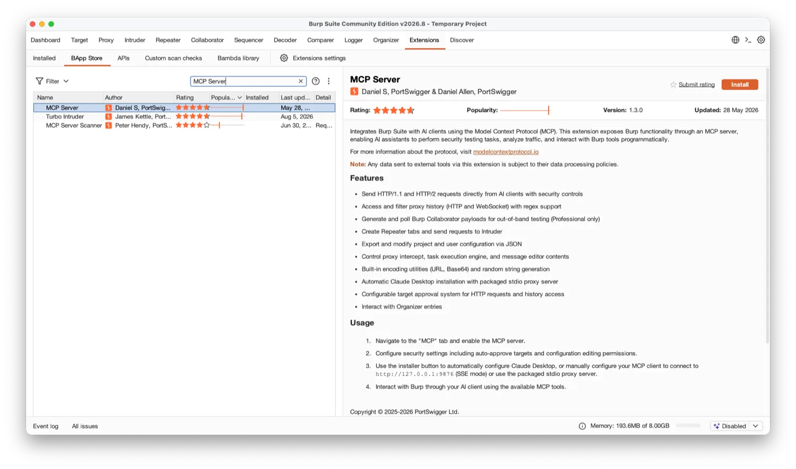

Burp drops the extension here, which is worth knowing because we’ll need it shortly:

```
~/.BurpSuite/bapps/9952290f04ed4f628e624d0aa9dccebc/burp-mcp-all.jar
```

Then open the new MCP tab and tick Enabled. Confirm the server is actually up:

```
$ lsof -nP -iTCP:9876 -sTCP:LISTEN
COMMAND     PID USER   FD   TYPE  DEVICE SIZE/OFF NODE NAME
JavaAppli 31887 meow   88u  IPv6  0x3d6a…      0t0  TCP 127.0.0.1:9876 (LISTEN)
```

Configuring the Approval Layer

Muse Code’s sandbox doesn’t contain MCP tools. The Burp extension, however, ships its own approval layer, and on a default install it’s already on, which means it will interrupt you. It’s worth setting this up before your first run rather than discovering it mid-task.

Here is what a fresh install gives you:

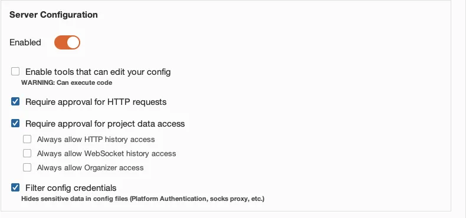

In that state the first `get_proxy_http_history` call pops a dialog in Burp and the run blocks until you answer it. That’s fine when you’re sitting in front of the GUI and wrong for anything scripted. Note that this is a second approval layer, entirely separate from Muse Code’s own, so `--disable-approval` on the CLI does nothing for it; two layers, two places to configure.

For a walkthrough like this one, switch the page on and get on with the work:

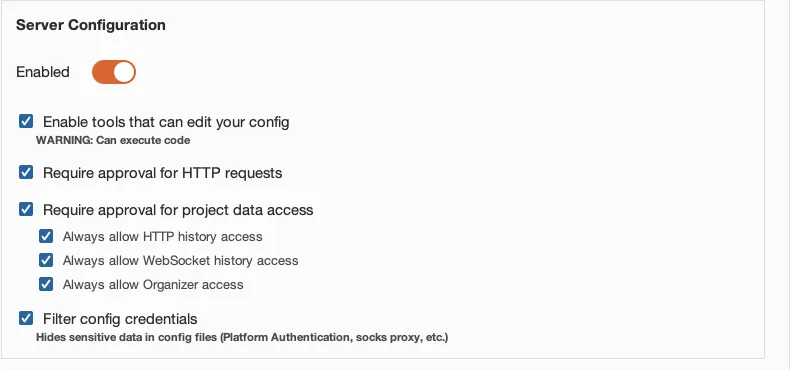

Expect dialogs even so. The always-allow toggles cover reads; outbound requests are governed separately by Require approval for HTTP requests, which stays on. To stop Burp prompting on every `send_http1_request`, add the target host to Auto-Approved HTTP Targets on the same page. On a demo target you can just answer the dialogs instead.

Bridging SSE to stdio

Burp speaks SSE, while Muse Code speaks `stdio` and `streamable_http`, and SSE is neither of those. Fortunately the extension ships a translator, `mcp-proxy-all.jar`, so the setup ends up being two separate processes:

```
Muse Code --stdio--> proxy (mcp-proxy-all.jar) --SSE 127.0.0.1:9876--> Burp Suite --> target

Burp Suite : launched by you, runs on its bundled JRE
proxy      : launched by Muse (the "command" in the config below), needs a standalone JDK
```

The proxy is bundled inside the BApp, so we’ll pull it out:

```
mkdir -p ~/.local/share/burp-mcp
unzip -p \
  "$HOME/.BurpSuite/bapps/9952290f04ed4f628e624d0aa9dccebc/burp-mcp-all.jar" \
  mcp-proxy-all.jar > "$HOME/.local/share/burp-mcp/mcp-proxy-all.jar"
```

Point the proxy at a standalone JDK (`brew install openjdk`); Burp’s bundled JRE can’t be invoked from the CLI on MacOS.

Wiring It Into Muse Code

Here’s the complete `settings.json`. Note that `command` points at the standalone JDK, not the one inside Burp:

```
{
  "schema_version": 1,
  "model": "muse-spark-1.3-contributor",
  "mcpServers": {
    "burp": {
      "transport": "stdio",
      "command": "/opt/homebrew/opt/openjdk/bin/java",
      "args": [
        "-jar",
        "/Users/you/.local/share/burp-mcp/mcp-proxy-all.jar",
        "--sse-url",
        "http://127.0.0.1:9876"
      ],
      "mode": "optional"
    }
  }
}
```

### Verifying It End to End

Start a session and run the `/mcp` slash command — it lists every configured MCP server, whether it loaded, and how many tools it exposes. You should see a single `burp` server with 24 tools at this point.

You can also ask the agent what it can see, which confirms the tool list the model actually receives:

Prompt

List every MCP tool you have available, grouped by which server provides it. Do not call any of them.

A healthy stack answers with the servers grouped and the tools namespaced `mcp__<server>.<tool>`:

```
Available MCP tools (1 server, 24 tools, not called):

**Server: `burp` (`mcp__burp.*`)**

- `mcp__burp.get_proxy_http_history`
- `mcp__burp.send_http1_request`
…
```

That single prompt catches the common failures at once: a server that didn’t start shows up as a startup warning and a missing group, a typo’d `transport` fails validation before the TUI appears, and a `required` server that’s down aborts the run outright.

Then prove a call actually round-trips. `url_encode` is the safest possible choice here, since it touches no network and no state. Ask for it in the same session:

Prompt

Call the burp MCP tool url\_encode on the exact string: a b&c=\<d> Then report the raw value it returned, nothing else.

```
a+b%26c%3D%3Cd%3E
```

Run this one interactively rather than through `muse exec`. Tool calls go through the approval layer, and a headless run has no UI to answer the prompt with, so it will sit there.

> [!CAUTION]
> **Policy enforcement and account blocks**
>
> This is security research, so the prompts and tool calls here can trigger policy enforcement and temporarily block your Muse Code account.

### What to do if your account is blocked

If your account is blocked, you’ll receive a request ID in the session. To get unblocked:

1. Go to [https://dev.meta.ai/support](https://dev.meta.ai/support)
2. Submit a ticket using the “Policy, Privacy, and Safety” contact reason
3. Include the term cybersecurity in the title
4. Include the request ID you received in your session

### Pointing It at a Real Target

> [!WARNING]
> **Authorized targets only**
>
> The target here is [ginandjuice.shop](https://ginandjuice.shop), PortSwigger’s deliberately vulnerable demo site, published for exactly this purpose. Do not point any of this at a host you are not authorized to test.

Seeding the Proxy History

The agent reads Burp’s history; it doesn’t generate traffic on its own. You can browse the target in Burp’s built-in browser, but driving `curl` through Burp’s proxy listener is faster and reproducible, and it means anyone can replay the exact same corpus.

Burp’s proxy listens on `127.0.0.1:8080` by default:

```
for u in \
  "https://ginandjuice.shop/catalog" \
  "https://ginandjuice.shop/catalog?searchTerm=gin" \
  "https://ginandjuice.shop/catalog?searchTerm=rum" \
  "https://ginandjuice.shop/catalog/product?productId=1" \
  "https://ginandjuice.shop/catalog/product?productId=2" \
  "https://ginandjuice.shop/blog" \
  "https://ginandjuice.shop/blog?searchTerm=cocktail" \
  "https://ginandjuice.shop/login" \
  "https://ginandjuice.shop/my-account" ; do
  code=$(curl -s -x http://127.0.0.1:8080 -k -o /dev/null -w "%{http_code}" -m 20 "$u")
  echo "$code  $u"
done
```

Nine requests, one of them a redirect; that’s the whole corpus the agent gets to reason about.

`-k` skips certificate validation because Burp presents its own CA. That’s fine for scripted seeding; if you’d rather browse the target through Burp in a normal browser, install Burp’s CA from `http://burp/cert` first.

Hand It the Goal, Not the Method

The map step is scaffolding. The actual test is whether the agent can pick its own lead and prove it, so the second prompt names no endpoint, no parameter, and no technique:

```
Use the burp MCP tools. I am authorized to test ginandjuice.shop.

There is proxy history for this host already. Start there: work out what the
application's attack surface actually is, pick the single lead you think is most
likely to be a real server-side vulnerability, and confirm or kill it using
send_http1_request.

Rules:
- Discover the parameters yourself. Do not assume the history shows all of them.
- Before you claim anything, prove it: a baseline, a request that breaks it, and
  a request that repairs it. A single anomalous response is not a finding.
- Report what you could NOT determine with these tools, and why.
- Do not extract data. Demonstrate the flaw, don't exploit it.
```

Then leave it alone and watch it work. Gin & Juice is seeded with known bugs and publishes the list, so the finding itself is not really the point. What is worth watching is which endpoints it decides are worth attention, which leads it kills, and whether what it finally claims arrives with a baseline, a break and a repair rather than one odd response.

The run behind this write-up picked a single lead, confirmed it with that three-request pattern, and discarded two competing leads with a stated reason for each. Yours will differ in the details, since the model is non-deterministic and the history you seeded is your own. Grade it against the site’s own [/vulnerabilities](https://ginandjuice.shop/vulnerabilities) page, which is the answer key.

## Part Two - Meta Bug Bounty Research

Meta Bug Bounty has built and open-sourced a toolkit to enable more efficient and better research experience. Designed from the start to be driven by an agent as much as by hand. The rest of this part installs it alongside the Burp MCP server from Part One, then works through two concrete examples of Meta bug bounty web research done with it.

[Zurp](https://github.com/facebookincubator/Zurp) is Meta’s open-source bug bounty research toolkit.

It ships its various capabilities so that you and your agents can use them, and research can be done by hand, by an agent, or by both at once.

To allow this, the repository carries every tool in two forms:

*   As a Burp extension, which annotates the traffic already flowing through your proxy and gives each tool its own tab.
*   As MCP servers that hand an agent the same capabilities over the same APIs and on the same token, so what your agent knows and what your Burp tab shows never disagree.

| Tool            | What it answers                                                                                                              | In Burp                                     | For an agent          |
| --------------- | ---------------------------------------------------------------------------------------------------------------------------- | ------------------------------------------- | --------------------- |
| Meta Context    | what is this id, URL, `doc_id` or operation?                                                                                 | Meta View tab on every Meta request         | `meta-context` server |
| FBDL            | where do I get accounts I am allowed to attack?                                                                              | Zurp -> FBDL tab, `{{fbdl.*}}` placeholders | `fbdl` server         |
| CSRF / sprinkle | why won’t this captured request replay?                                                                                      | automatic on the request path               | n/a                   |
| SPARTA          | (available only during specific engagement like live hacking events)   what are the interesting leads in the targeted scope? | Zurp -> SPARTA tab                          | `sparta` server       |

### How these Tools Fit Together

This is what the setup was for. They pair, in roughly a fixed order.

Meta Context says what you are looking at. A bare `1000641…` in a response body could be a user, a group, a comment … Meta Context resolves things like object ids, ad accounts written `act_<digits>`, URLs, persisted GraphQL `doc_id`s to their object type, url or graphql friendly names.

It is a map from identifiers to name and types in Meta context.

It will show in Meta View tab that should appear now on all requests/responses from Meta products

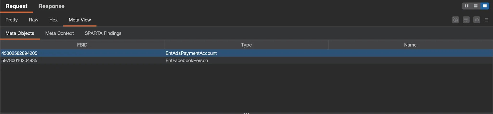

FBDL. FBDL is a tool designed to help you quickly and efficiently setup security bug reproduction steps using a standard “bug” description language. FBDL is a solution to the long standing challenge of reproducing the scenarios needed to demonstrate security issues. The content provided here is intended to help researchers better understand FBDL’s features, how it works, and how to use it to their advantage when submitting bugs.

In Burp UI you find the tool in Zurp -> FBDL tab

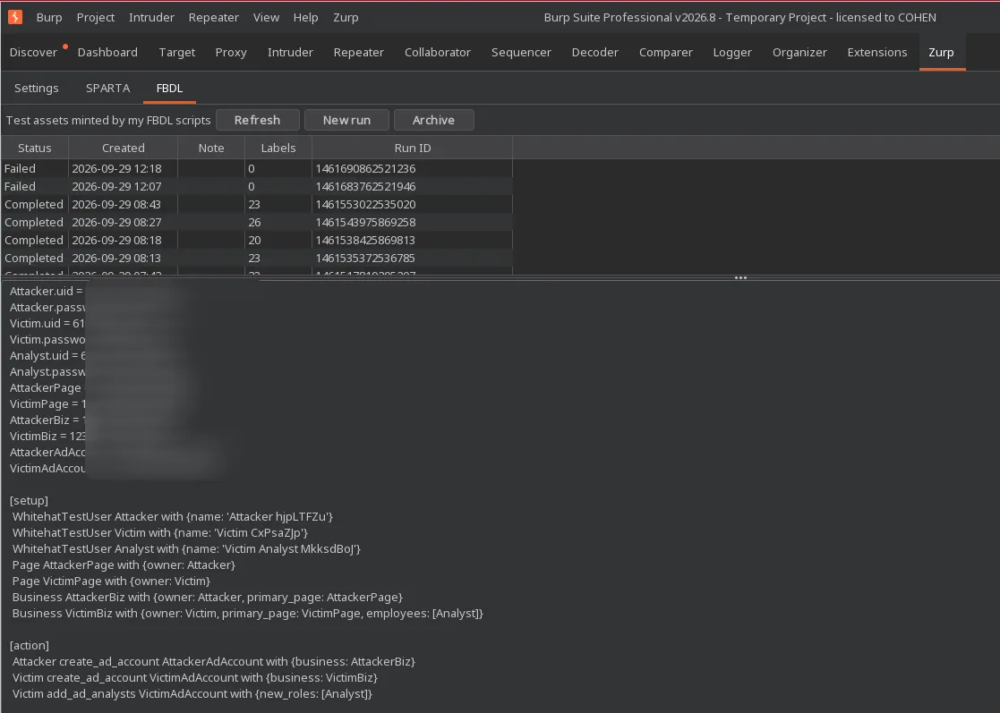

CSRF substitution makes the request actually send. Burp-only, and the one piece with no agent equivalent, because it is a property of sitting on the request path. Zurp scrapes `fb_dtsg` and friends out of the responses you browse, keyed per host and per logged-in account, and substitutes `{{fb_dtsg}}`, `{{lsd}}` and `{{csrf}}` on the way out while keeping the parameters that depend on them consistent. Keying per account is what makes a two-actor test work: victim cookies in one tab and attacker cookies in another each get their own token instead of overwriting each other’s.

The two halves of the toolkit meet at the placeholders. A run created by `create_fbdl_run` shows up in Burp’s FBDL tab like any other; `Pin FBDL run…` in the Repeater or Intruder context menu writes its id into the request, and `{{fbdl.<run id>.<label>}}` then resolves to that run’s values on send:

```
POST /api/graphql/ HTTP/2
Host: www.facebook.com
Content-Type: application/x-www-form-urlencoded

fb_dtsg={{fb_dtsg}}&jazoest=0&doc_id=9876543210987654&variables=
  {"pageID":"{{fbdl.1234567890123456.VictimPage}}",
   "actorID":"{{fbdl.1234567890123456.OwnerA.uid}}"}
```

SPARTA says where to look. During specific engagements such as private bounty or live hacking events we organize. SPARTA tool will be available to provide assistance and guidance on specific targeted scope. This is done through leads. `sparta_scan_traffic` takes a capture, pulls the `doc_id` and `fb_api_req_friendly_name` out of it, and reports every SPARTA leads raised against them.


### Before Anything Else, Access

Every endpoint behind all these tools is gated in the same way as FBDL. If you can use FBDL your existing token works for all of it; if you cannot, every call answers `403`.

The criteria, and how to qualify, are at [facebook.com/whitehat/fbdl](https://www.facebook.com/whitehat/fbdl/).

Mint a token at [facebook.com/whitehat/fbdl/generate\_api\_token](https://www.facebook.com/whitehat/fbdl/generate_api_token) like in the screenshot below.

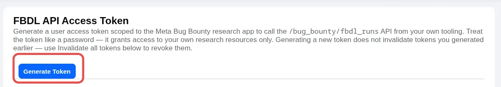

One token drives the extension and all three MCP servers, and it lasts 60 days.

### Installing the Burp Extension

Part One could fully run on Burp Community. This part needs Burp Professional for taking advantage of all the burp extension functionalities.

Download `zurp.jar` from the [latest release](https://github.com/facebookincubator/Zurp/releases/latest), then in Burp go to Extensions → Installed → Add, set the extension type to `Java`, select the jar, and click Next. A successful load reports The extension loaded successfully.

Open the new Zurp suite tab and, under Settings and paste here the API Access Token generated earlier.

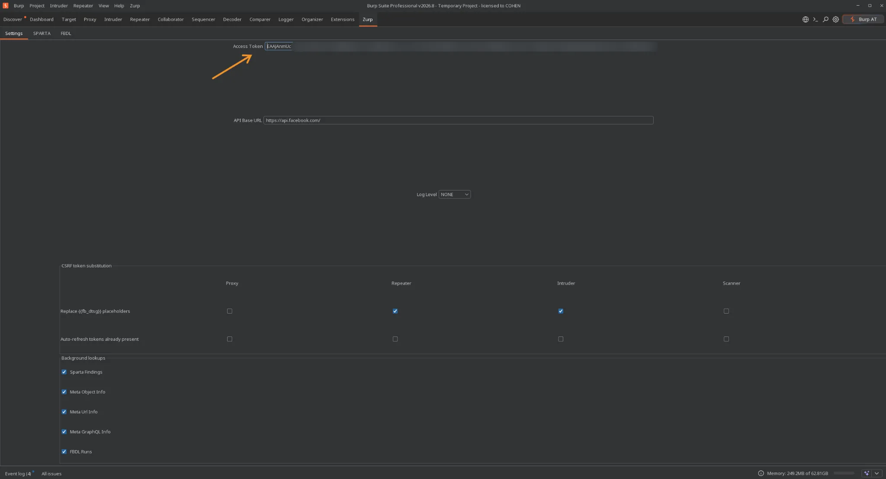

Then two checks, in this order.

Go to Zurp → FBDL and click refresh: a list of findings populating the panel proves the token, the allowlist and the network path in one go.

Then browse anything on facebook.com through the proxy, and confirm that Meta requests and responses have gained a Meta View editor tab.

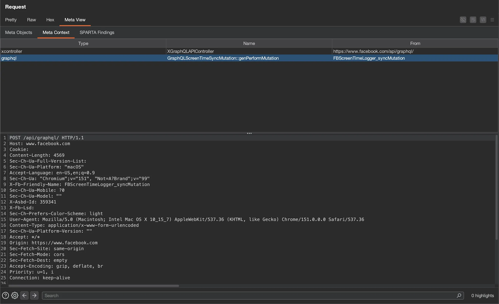

### Wiring Up the Zurp MCP Servers

`bug-bounty-research/` is a standalone Node package in the same repository.  

It needs Node 22.19.0 or newer. Make sure Node.js 22.19.0 or newer and npm are installed:

```
node --version
npm --version
```

Download, build and Install Zurp MCP in the standard per-user Muse data directory:

```
git clone https://github.com/facebookincubator/Zurp.git ~/.local/share/zurp
cd ~/.local/share/zurp/bug-bounty-research
npm install
npm run build
```

The build creates the following MCP server entry points:

```
dist/meta-context/index.js
dist/sparta/index.js
dist/fbdl/index.js
```

Add the Zurp MCP servers to [Muse Code](https://developer.meta.com/ai/lp/muse-code/?utm_source=search&utm_medium=Muse-Code-Tier-2&utm_campaign=paid&utm_term=phrase-match-muse-code&gad_source=1&gad_campaignid=24108554840&gbraid=0AAAAAC2gQWA8K6AuldLdRfQLQ-GVp9e3J&gclid=CjwKCAjww-3VBhAcEiwAwUUIu3U1PX3vA0AibxkIv0fPfH8Y1YfR25UP2B7yId2EhgrIuQi67WObUBoC1pkQAvD_BwE).

Open the Muse configuration file:

```
~/.config/muse/settings.json
```

install the MCPs with the following settings and the same access token you got earlier

```
{
  "schema_version": 1,
  "mcpServers": {
    "meta-context": {
      "transport": "stdio",
      "command": "node",
      "args": [
        "/Users/<name>/.local/share/zurp/bug-bounty-research/dist/meta-context/index.js"
      ],
      "env": {
        "BB_RESEARCH_TOKEN": "<your-researcher-api-token>"
      },
      "mode": "optional"
    },
    "sparta": {
      "transport": "stdio",
      "command": "node",
      "args": [
        "/Users/<name>/.local/share/zurp/bug-bounty-research/dist/sparta/index.js"
      ],
      "env": {
        "BB_RESEARCH_TOKEN": "<your-researcher-api-token>"
      },
      "mode": "optional"
    },
    "fbdl": {
      "transport": "stdio",
      "command": "node",
      "args": [
        "/Users/<name>/.local/share/zurp/bug-bounty-research/dist/fbdl/index.js"
      ],
      "env": {
        "BB_RESEARCH_TOKEN": "<your-researcher-api-token>"
      },
      "mode": "optional"
    }
  }
}
```

Then the skills. Which teach the agent which tool to reach for and which errors are worth retrying, and Muse Code takes them one at a time:

```
cd ~/.local/share/zurp/bug-bounty-research
for skill in meta-context sparta use-fbdl-mcp generate-fbdl validate-fbdl; do
  muse skills install "skills/$skill" --scope user
done
```

Verifying It End to End

Run `/mcp` in a new session — you should see `meta-context`, `sparta`, and `fbdl` alongside `burp`, all loaded optional. You can also ask the agent:

```
List every MCP tool you have available, grouped by which server provides it. Do not call any of them.
```

The output should list the freshly installed MCPs like the following

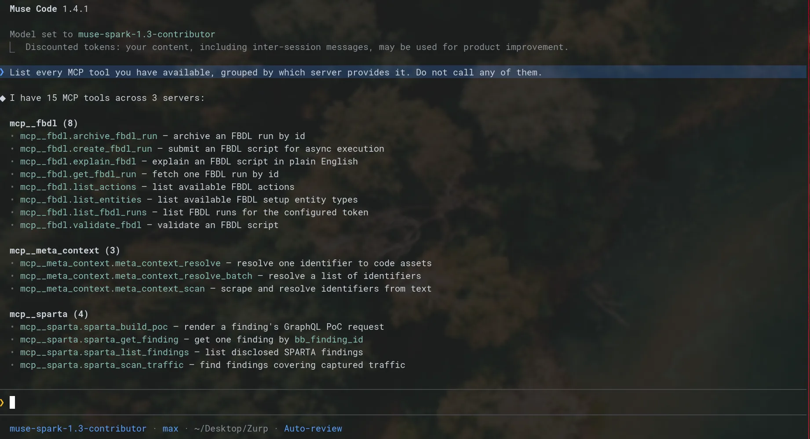

### Pointing It at Meta

> [!WARNING]
> **The programme’s rules apply from here**
>
> Everything up to now was a demo site, now you will be doing real research on Meta’s product.
>
> Work only against accounts you own (eg: created via FBDL), and make sure you have read and acknowledged the [Meta Bug Bounty scope and terms](https://bugbounty.meta.com/en-gb/terms/).
>
> Reporting a finding should be done at [bugbounty.meta.com/report/](https://bugbounty.meta.com/)

### Workflow Example 1

In this workflow, Muse Code acts as the investigation orchestrator.

Muse Code creates controlled test accounts, operates browsers, generates relevant traffic, searches the resulting Burp Proxy history, prepares tests and sends promising candidates to Burp Repeater.

The researcher defines the hypothesis and reviews/reproduces the candidates in Repeater before deciding whether a vulnerability exists.

There are several ways to give an LLM control over Chrome, including using chrome-devtools-mcp or connecting directly through the Chrome DevTools Protocol (CDP). In this example, we use CDP directly because it may be more token-efficient for this type of workflow(see #[797](https://github.com/ChromeDevTools/chrome-devtools-mcp/issues/797?utm_source=chatgpt.com)).

```
/goal Investigate contact point disclosure vulnerabilities in Facebook.

You can use:
- fbdl MCP to create controlled Whitehat test accounts.
- Burp MCP to search captured traffic, inspect requests and responses, and
  preserve tested requests in Repeater.
- meta-context MCP to determine what Meta identifiers, URLs, GraphQL document
  IDs, operation names, and Bloks IDs represent.
- sparta MCP to find GraphQL operations flagged by Meta's automated security
  scanner as potentially vulnerable, and generate PoC templates for validation.

Sparta findings are investigation leads, not confirmed vulnerabilities. Use
controlled FBDL values when testing a sparta proof of concept.

Browser control:
You can launch an isolated Chrome profile under /tmp with CDP and proxy enabled.
Use it to navigate Facebook, authenticate controlled accounts, exercise relevant
product features, reproduce flows, and generate traffic in Burp.

  --user-data-dir=/tmp/<unique-profile-directory>
  --remote-debugging-address=127.0.0.1
  --remote-debugging-port=<debug port>
  --proxy-server=http://127.0.0.1:8080

Investigation strategy:
Start from disclosed SPARTA findings. For promising leads, use FBDL to create the
account states and relationships needed to exercise the suspected authorization
boundary, then adapt and investigate the SPARTA PoC for contact-point disclosure.
Consider adult and minor accounts, pending, current and revoked friendships,
blocked profiles, and primary and additional profiles belonging to the same
account.

Stop after finding one reproducible positive vulnerability.

For a positive finding, send the relevant requests to clearly named Burp Repeater
tabs and preserve enough evidence for human verification.
```

The division of labour is the point of that last instruction. Muse Code is the orchestrator: it creates the accounts, drives the browsers, generates the traffic, searches the resulting proxy history, and parks the candidates it likes in named Repeater tabs.

You define the hypothesis and you reproduce the candidate before deciding a vulnerability exists. Leaving the evidence in Repeater rather than in a transcript is what makes the second half possible — and the captured request replays, because `fb_dtsg={{fb_dtsg}}` is filled in on send by the CSRF plane rather than being a token that expired twenty minutes ago.

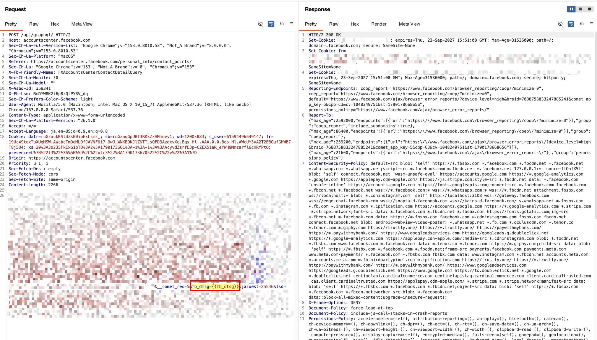

### Workflow Example 2

Suppose your goal is to uncover contact-point disclosure vulnerabilities across Facebook, a scope precisely delineated in Meta's [payout guidelines](https://bugbounty.meta.com/en-gb/payout-guidelines/uii-to-uid/). By leveraging the full suite of tools detailed above, the following prompt guides an agentic workflow designed to scale your security research exponentially.

```
You are hunting contact-point disclosure vulnerabilities in Facebook. That is, ways an attacker can leak another user's email. For example an IDOR where swapping an ID or an email parameter returns someone else's contact data. Success means a request, authenticated as the attacker, whose response contains the victim's exact email or other non-public user-object field. Show findings to me with the full request/response
evidence.

Steps

1. Read the FBDL skills. Then create an environment with an attacker and two victim users with unique emails, plus group/page fixtures. Record every id and email.

2. Build yourself a way to use Facebook as these users and capture the traffic. Get real login sessions plus a full request/response corpus that you can replay. Keep Burp in the chain as your replay and history tool, do not change its configuration.

3. Drive the product hard as attacker and the victims, so account settings, contact points, profiles, friends, groups, messages, search. Keep going until you have a rich, corpus. Same routes across sessions where comparison matters.

Notes
* Check the corpus, find where user identity flows through requests, and test whether one user's session can pull another user's data by swapping identity parameters (ids, emails) in replayed requests.
* Every swap test needs a working unmodified baseline first. If the baseline doesn't return the attacker's own data cleanly, the test proves nothing, fix the replay before drawing conclusions.
* Verify each victim's expected email independently (through the UI) before trusting any traffic finding. Distinguish real leaks from static strings and generic digit matches.
* GraphQL mutations are writes: capture it, but replay nothing that changes state without asking me first.

Restrictions
* Budget roughly 100 replayed requests per goal.
* All test traffic through isolated browsers via a proxy chain.
* Report per-target verdicts with control-vs-test evidence. If the corpus exhausts with no finding, say so plainly and propose the next fixture or surface, don't burn the budget
```

Output will look like the following

```
Agents
├─ fixture (Fixture setup for Facebook contact-point disclosu…) · Done (17 tool uses · 581.4k tokens · 2m 5s)
├─ harness (Traffic harness. Fixture ref: owner-result-ref:de…) · Done (98 tool uses · 7.1m tokens · 22m 46s)
├─ corpus (Corpus drive. Refs: fixture owner-result-ref:dedu…) · Done (25 tool uses · 889.5k tokens · 12m 50s)
├─ swaptest (Swap testing for contact-point IDOR. Refs: owner-…) · Done (42 tool uses · 3.0m tokens · 9m 34s)
└─ synthesis (Synthesize contact-point hunt. Refs: owner-result…) · Done (5 tool uses · 152.0k tokens · 35s)
```

And the following diagram represents how the workflow the agent did looks like:

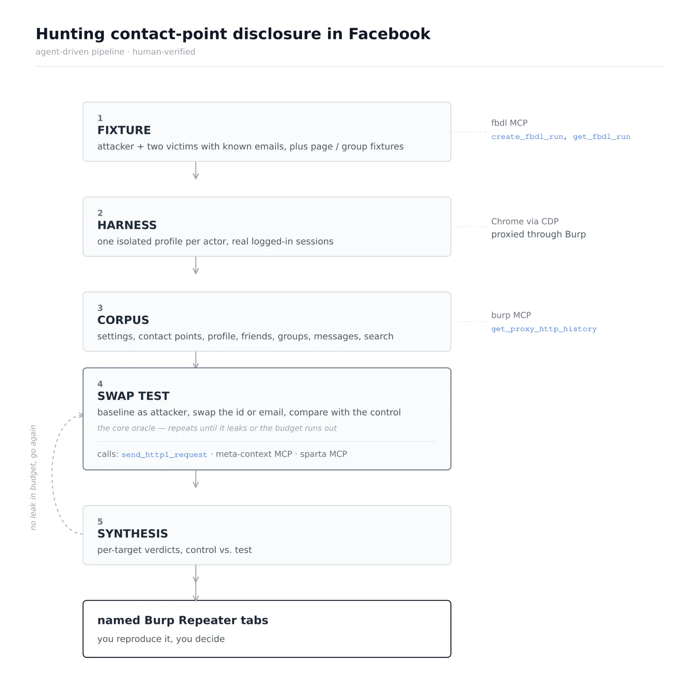

## Part Three - Native Binaries

So far we’ve been hunting network-layer vulnerabilities. Now we’ll go a layer down, to native bugs: a stripped binary, a file that crashes it, and (in theory) no source. Two more MCP servers, Ghidra for structure and LLDB for runtime values, pointed at a real CVE in a media decoder.

This half needs a few things the web half didn’t: `cmake` and a C toolchain to build the target, `uv` for both MCP servers, and Rosetta to run an x86\_64 binary on Apple Silicon. On MacOS that is `brew install cmake uv`, `xcode-select --install`, and `softwareupdate --install-rosetta`.

### Wiring Up Ghidra, Headless

For headless work we’ll use [`pyghidra-mcp`](https://github.com/clearbluejar/pyghidra-mcp), which drives Ghidra through PyGhidra and JPype and speaks `streamable-http` natively.

That’s two installs, with Ghidra itself first:

```
brew install ghidra          # 12.1.3, ~800 MB
```

Homebrew’s `openjdk` is keg-only and `/usr/bin/java` is a MacOS stub, so you’ll need to set both explicitly. Note that the Ghidra formula installs its runtime under `libexec`, not the formula root:

```
export JAVA_HOME=/opt/homebrew/opt/openjdk
export GHIDRA_INSTALL_DIR=/opt/homebrew/opt/ghidra/libexec
```

Then add it to the `mcpServers` block:

```
"ghidra": {
  "transport": "streamable_http",
  "url": "http://127.0.0.1:8000/mcp",
  "mode": "optional"
}
```

### Wiring Up LLDB

[`stass/lldb-mcp`](https://github.com/stass/lldb-mcp) spawns and manages its own LLDB sessions over a pty, and exposes 28 typed tools. It needs a modern Python and the `lldb` that’s already on your `PATH`.

```
git clone https://github.com/stass/lldb-mcp.git
uv venv --python 3.13 ~/lldb-mcp-venv
VIRTUAL_ENV=~/lldb-mcp-venv uv pip install "mcp<2"
```

And alongside it in the same block:

```
"lldb": {
  "transport": "stdio",
  "command": "/Users/you/lldb-mcp-venv/bin/python",
  "args": ["/Users/you/lldb-mcp/lldb_mcp.py"],
  "mode": "optional"
}
```

### Building the Target

The target here is CVE-2016-10506 in [OpenJPEG](https://github.com/uclouvain/openjpeg), the reference JPEG 2000 decoder. It’s a SIGFPE in the packet iterator, found by Ke Liu of Tencent’s Xuanwu Lab, and the original 436-byte proof-of-concept is still attached to the [public issue](https://github.com/uclouvain/openjpeg/issues/732).  

You need that file before the build below can crash anything, so here it is inline. Run this from wherever you are building; it writes the `sample_crash_001.jp2` the decoder is fed:

```
base64 -d > sample_crash_001.jp2 <<'EOF'
AAAADGpQICANCocKAAAAFGZ0eXBqcDIgAAAAAGpwMiAAAAAtanAyaAAAABZpaGRyAAAAIAAAACAA
AweHAAAAAAAPY29scgEAAAAAABAAAAFnanAyY/9P/1EALwAAAAAAAQAAACAAAAAAAAAAAIAAACAA
AAAgAAAAAAAAAAAAAwcCAQcBAYoBAf9SAAwABAABAREEBIAB/1wABEBA/2QAJQABQ3JlYXRlZCBi
eSBPcGVuSlBFRyB2ZXJzaWZ0eXAuMS4w/5AACgAAAAAA7wAB/5PfB1YANB/WzgwnT0scoB/vuZfg
c1PvCOOcZjXu94sFdFbBplUpDNQKo/J/xlMus9LPf6OB3S2g7cWVduNF1Jaz7rIDsiUuZP97i6v6
AKLEZkELDIYYc/9zmmka8yiifaZFEnVtgpHmcWvWIj909OzjqMTdl/xjGiEA30lKlsnQgHvkAAAA
DCQlU8IGCRzPVltBDquXVV1SKEgCZ6AAAL//MDWwLWWTjY66dD2zcDL4QNwgyHZAed8ygGb/NYsD
EkIdgqz2vhAr2q6hLHANUHiJLHTG3LUbzHETySr/f/9//3//2Q==
EOF
```

You should end up with 436 bytes, `sha256 4a20941ada8ebf356abcd1b498d044cf2585a1c1c03e390c2638281e0967b2b1`. The header fields that drive the crash are all visible in it: `Scod=0`, `COD prog=4`, `levels=17`, `SIZ Csiz=3` and `XRsiz=2`.

The plan is simple enough: check out an unpatched commit, build it, and reproduce the crash. Two build details matter.

Building for x86\_64 on Apple Silicon

Apple Silicon has no divide-by-zero trap; arm64 returns 0 and execution continues, so a divide-by-zero CVE won’t crash natively. We’ll build for `x86_64` and run under Rosetta, as the build below does, and as a bonus Ghidra then shows x86\_64 disassembly.

Checking Out a Commit Contemporaneous With the PoC

The fix is `d27ccf01` (July 2017). Its parent still contains the bug, but an unrelated hardening commit from May 2016 rejects the 2016 PoC at parse time, so we’ll check out a commit from before that:

```
git clone https://github.com/uclouvain/openjpeg.git && cd openjpeg
git rev-list -1 --before=2016-03-29 master    # 0069a2bd
```

The Build

```
git checkout 0069a2bd                                  # 2016-01-30, unpatched

cmake -S . -B build -DCMAKE_POLICY_VERSION_MINIMUM=3.5 \
  -DCMAKE_OSX_ARCHITECTURES=x86_64 -DCMAKE_BUILD_TYPE=Release \
  -DCMAKE_C_FLAGS="-O2" -DBUILD_CODEC=ON \
  -DCMAKE_DISABLE_FIND_PACKAGE_PNG=ON \
  -DCMAKE_DISABLE_FIND_PACKAGE_TIFF=ON \
  -DCMAKE_DISABLE_FIND_PACKAGE_LCMS2=ON
cmake --build build -j8
strip build/bin/opj_decompress -o decoder
```

The three `CMAKE_DISABLE_FIND_PACKAGE_*` flags switch off OpenJPEG’s optional PNG, TIFF and LCMS2 support. None of it is on the JP2 decode path we care about, and leaving it enabled has this 2016 tree configure against far newer system libraries.

```
$ ./decoder -i sample_crash_001.jp2 -o /tmp/out.pgm
$ echo $?
136
```

This is why we strip it. With `-g` and sources on disk, LLDB hands the agent `pi.c:526` on the first backtrace and there’s no reverse engineering left to do. Stripped and optimized, the symbol count drops from 736 to 55 and the fault reports as:

```
frame #0: 0x0000000100030f06 decoder`___lldb_unnamed_symbol_100030230 + 3286
```

With no symbol name, no line number and no source to fall back on, the agent has to work it out from the binary itself.

### Verifying Both Servers

Now that `decoder` exists, start the Ghidra bridge against it and leave it running; the first launch pays for import and auto-analysis, and every later tool call reuses the same project:

```
uvx pyghidra-mcp -t streamable-http --project-path /tmp/pyghidra ./decoder
# INFO: Uvicorn running on http://127.0.0.1:8000
```

This is the same check as the web half, and it’s worth repeating now that three servers have to come up together. The complete `settings.json`:

```
{
  "schema_version": 1,
  "model": "muse-spark-1.3-contributor",
  "mcpServers": {
    "burp": {
      "transport": "stdio",
      "command": "/opt/homebrew/opt/openjdk/bin/java",
      "args": ["-jar", "/Users/you/.local/share/burp-mcp/mcp-proxy-all.jar", "--sse-url", "http://127.0.0.1:9876"],
      "mode": "optional"
    },
    "ghidra": {
      "transport": "streamable_http",
      "url": "http://127.0.0.1:8000/mcp",
      "mode": "optional"
    },
    "lldb": {
      "transport": "stdio",
      "command": "/Users/you/lldb-mcp-venv/bin/python",
      "args": ["/Users/you/lldb-mcp/lldb_mcp.py"],
      "mode": "optional"
    }
  }
}
```

Start a new session and run `/mcp`, then the same tool-listing prompt from [Verifying It End to End](#part-one---web-endpoints). You’re looking for three groups rather than one, with `mcp__ghidra.*` and `mcp__lldb.*` alongside `mcp__burp.*`. If Ghidra’s bridge died quietly this is where you find out, rather than twenty tool calls into an investigation.

### Pointing It at the Binary

The prompt names no function, no file format field, and no bug class. The `SIGFPE` is observable, so there’s no point hiding it; everything else is the agent’s job.

```
Use the ghidra and lldb MCP tools. This is my own build of an open-source media
decoder, running on a machine I own — analysis is authorized.

Binary (stripped: no source, no debug symbols, already imported into the Ghidra
project): /path/to/decoder
Input that makes it crash: /path/to/sample_crash_001.jp2
Run it as: decoder -i <that file> -o /tmp/out.pgm

Work out the root cause and tell me:
1. What the fault is at instruction level, and the exact operand values that produce it.
2. Which function it happens in. Symbols are stripped, so recover its purpose from the
   decompilation and give it a name that reflects what it does.
3. Why a malformed input file can reach that state — what the attacker actually controls.
4. The single check that would prevent it.

Rules:
- Prove every claim with tool output. Read the operand values, don't infer them.
- Ghidra for structure, lldb for runtime values. State which tool gave you each fact.
- If you rename functions or add comments in Ghidra, say what you renamed and why.
- Report what you could NOT determine, and why.
```

Then let it work. As with the web half, watch how it moves between the two servers, whether it reads values out of the debugger rather than inferring them from the decompilation, and what it reports that it could not determine.

The run behind this write-up set a breakpoint before the faulting shift, stepped a single instruction and read the register again rather than assuming the overflow; recovered the stripped function’s purpose from its decompilation; traced the fault back to specific fields in the 436-byte input; and proposed the same guard the upstream patch adds. It stopped at denial of service rather than claiming memory corruption.

Yours will differ in the details. Grade it against the real fix in [d27ccf01](https://github.com/uclouvain/openjpeg/commit/d27ccf01c68a31ad62b33d2dc1ba2bb1eeaafe7b).

## Next Steps

*   Put a `PreToolUse`[hook](https://dev.meta.ai/docs/muse-code/extending#hooks) in front of the MCP tools. It’s the one place you can enforce scope on a tool the sandbox can’t contain; match on `mcp__burp.send_http1_request` and reject out-of-scope hosts, or on `mcp__ghidra.rename_function` to keep a run read-only.
*   Package a recurring investigation as a [skill](https://dev.meta.ai/docs/muse-code/extending#skills), so "map this app’s attack surface" or "triage this crash" becomes one invocation with the rules already attached.
*   Split a large audit across parallel [subagents](https://dev.meta.ai/docs/muse-code/extending#multi-agent), one endpoint or one binary each.
*   Run a triage pass in CI with [`muse exec`](https://dev.meta.ai/docs/muse-code/extending#headless), remembering that its exit code reports how the run ended rather than whether the finding is real, so gate on your own checks.

## License

See [LICENSE](../../LICENSE) for details.
